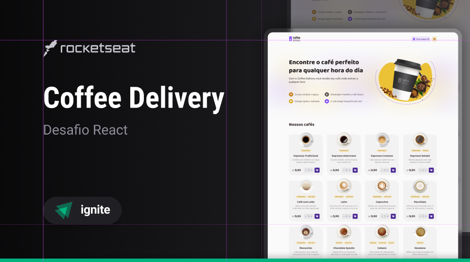

# 📝 E-commerce Coffee Delivery

Coffee Delivery is a fictional e-commerce developed in a Rocketseat challenge in React classes. In this project is applicated studies like Context API, States, LocalStorage, Properties and much more!

😉 Check this awesome project cloning this repository and run commands "npm i" and "npm run dev" in your vs code.

## 🖌️ Layout in Figma

The project layout in Figma can be checked  clicking here 👉 [Layout](https://www.figma.com/file/5yT9ZzZmRQRS4yivGGB3pl/Coffee-Delivery/duplicate)

## ✏️ With Coffee Delivery you can:

- [x] Choose a variety of coffees;
- [x] Order wherever you are;
- [x] Pay with money, debit and credit card;

## 💻 technology's 

- 🔵 React